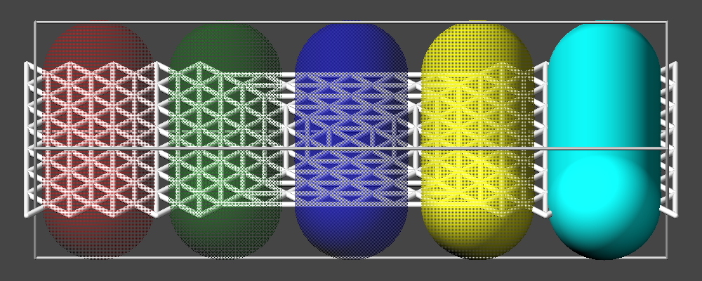
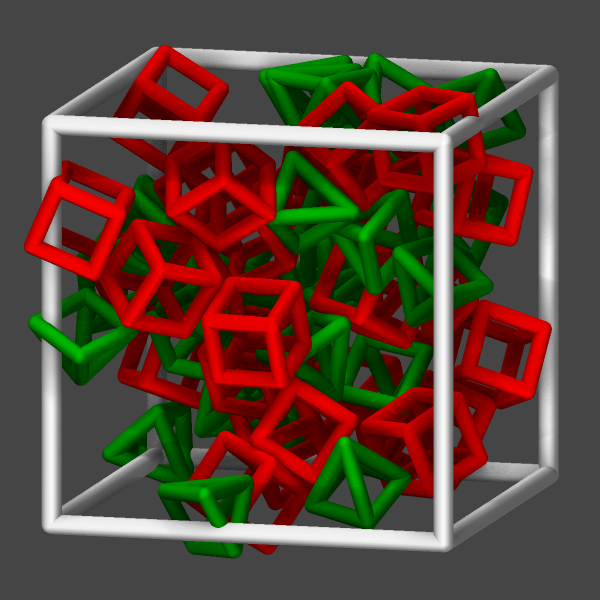
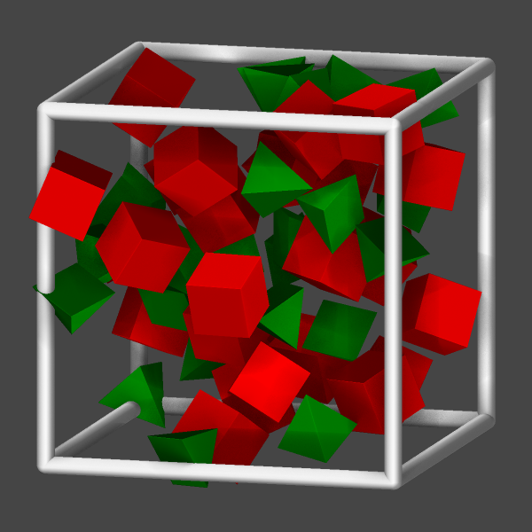
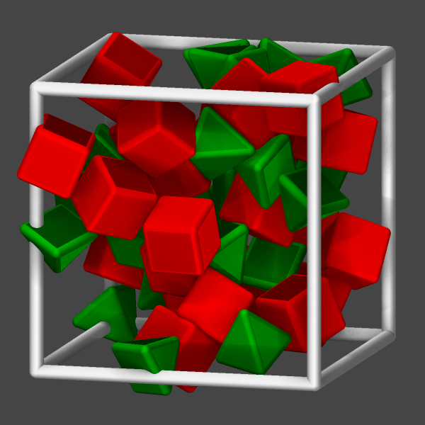
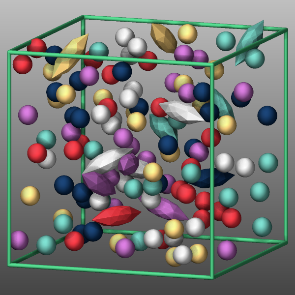

Visualize LAMMPS snapshots
==========================

Snapshots from LAMMPS simulations can be viewed, visualized, and
analyzed in a variety of ways.

LAMMPS snapshots are created by the :doc:`dump <dump>` command, which
can create files in several formats. The native LAMMPS dump format is a
text file (see :lammps:`dump atom` or :lammps:`dump custom`) which can
be visualized by `several visualization tools
<https://www.lammps.org/viz.html>`_ for MD simulation trajectories.
`OVITO <https://www.ovito.org>`_ and `VMD
<https://www.ks.uiuc.edu/Research/vmd/>`_ seem to be the most popular
choices among them.

The :doc:`dump image <dump_image>` and :doc:`dump movie <dump_image>`
styles can output internally rendered images or convert them to a movie
during the MD run.  It is also possible to create visualizations from
LAMMPS inputs or restart file with `LAMMPS-GUI
<https://lammps-gui.lammps.org/>`_, which uses the :doc:`dump image
<dump_image>` command internally.  If the LAMMPS input already contains
a :doc:`dump image <dump_image>` command, the resulting images will be
noted by LAMMPS-GUI and can be viewed and animated directly in the
``Slide Show`` dialog. The images can be transformed (i.e. scaled,
mirrored, or rotated) and exported into a video, too.  The ``Image
Viewer`` dialog in LAMMPS-GUI can be used to visualize the *current*
system, adjust a variety of visualization settings interactively from
the GUI, and then one can export the corresponding LAMMPS commands to
the clipboard to be inserted into an input file.

Programs included with LAMMPS as auxiliary tools can convert
between LAMMPS format files and other formats.  See the :doc:`Tools
<Tools>` page for details.  These are rarely needed these days.

------------------------

Advanced graphics features in the *dump image* command
======================================================

.. versionadded:: TBD

The following paragraphs discuss some of the more advanced features in
the :doc:`dump image <dump_image>` command in LAMMPS with the help of
some simple input file examples.  For exact details of keywords and
arguments, please refer to the detailed documentation of the command.

Please note that many of these features were added or significantly
updated after LAMMPS version 10 Sep 2025 and well into the 2026
stable version development cycle.  If you are using an older version
of LAMMPS, these examples will cause errors or may look differently.

.. contents:: Available topics
   :local:

------------

Image quality and resolution
----------------------------

The two keywords *fsaa* and *ssao* can be used to improve the image
quality at the expense of additional computational cost to render the
images. The images below show from left to right the same render with
the default settings, with *fsaa* enabled, with *ssao* enabled, and with
both features enabled.

.. |imagequality1| image:: JPG/image.default.png
   :width: 24%
.. |imagequality2| image:: JPG/image.fsaa.png
   :width: 24%
.. |imagequality3| image:: JPG/image.ssao.png
   :width: 24%
.. |imagequality4| image:: JPG/image.both.png
   :width: 24%

|imagequality1|  |imagequality2|  |imagequality3|  |imagequality4|

The computational cost to create the images with :doc:`dump image
<dump_image>` depends on the image size, the number of objects to be
rendered (this number can grow quickly when using fine triangle meshes),
and the choice of the *fsaa* and *ssao* settings.  For high resolution
images, a correspondingly large image size has to be chosen.  Same as it
is done implicitly when enabling FSAA, one can improve image quality by
rendering images at a large size and then processing and scaling them to
the desired size in a image processing software.  Since the simulation
has to wait for dump image to complete its image rendering, creating
high resolution and high quality images can slow down as simulation
significantly.  On the other hand, the image rasterizer in LAMMPS is
fairly simple and thus fast compared to more advanced image generation
tools like ray tracers.  At the moment there is no GPU acceleration or
multi-threading parallelization available, except for the
multi-threading support for SSAO processing.

--------------------

Transparency
------------

.. versionadded:: TBD

It is now possible to create approximately transparent graphics objects
using an `ordered dithering algorithm
<https://en.wikipedia.org/wiki/Ordered_dithering>`_ which results in a
so-called *screen-door transparency* effect.  In essence, for a
transparent object only a part of the pixels are drawn and thus exposing
any object behind the transparent object where drawing the pixels is
skipped.  LAMMPS employs a 16x16 Bayer matrix pattern that leads to
rather regular patterns.  A benefit of this approach is that it does not
at extra cost to the rendering and for a 25%, 50%, and 75% transparency
setting, there are no visible pixel patterns when also FSAA is enabled.
In this case each pixel is the average of a 2x2 block and thus the
transparent object will contribute 3, 2, or 1, pixels to each pixel.

Transparency is typically - like the color of objects - associated with
an atom type and can be modified through the :doc:`dump_modify atrans
<dump_image>` command and specified as an opacity ratio, i.e. a number
between 0 (fully transparent) and 1 (fully opaque).  Other choices are
available and described in the documentation page.

.. |transparency2| image:: img/transparent-2.png
   :width: 49%

|transparency1|  |transparency2|

.. raw:: html

   
(Transparency example with opacity set to 0.25, 0.33, 0.5,
   0.75, and 1.0 (left to right): left: without FSAA, right: with
   FSAA. Click to see the full-size images)

-----------------------

Creating and viewing animated GIFs and movie files
--------------------------------------------------

A series of JPEG, PNG, or PPM images can be converted into a movie file
and then played as a movie using commonly available tools.  Using dump
style *movie* automates this step *and* avoids the intermediate step of
writing (many) image snapshot file.  But LAMMPS has to be compiled with
``-DLAMMPS_FFMPEG`` and a compatible FFmpeg executable has to be
installed.  When using `LAMMPS-GUI <https://lammps-gui.lammps.org/>`_ to
run LAMMPS, you can run the simulation and LAMMPS-GUI will automatically
show the created images in its ``Slideshow Viewer`` dialog.  From there
you can animate or single step through them and also export them to a
movie file via FFMpeg.

To manually convert JPEG, PNG or PPM files into an animated GIF or
MPEG or other movie file you can use:

#. Use the ImageMagick ``convert`` program (called ``magick`` in recent versions).

   .. code-block:: bash

      convert *.jpg foo.gif
      convert -loop 1 *.ppm foo.mpg

   Animated GIF files from ImageMagick are not optimized. You can use
   a program like gifsicle to optimize and thus massively shrink them.
   MPEG files created by ImageMagick are in MPEG-1 format with a rather
   inefficient compression and low quality compared to more modern
   compression styles like MPEG-4, H.264, VP8, VP9, H.265 and so on.

#. Use QuickTime.

   Select "Open Image Sequence" under the File menu Load the images into
   QuickTime to animate them Select "Export" under the File menu Save the
   movie as a QuickTime movie (\*.mov) or in another format.  QuickTime
   can generate very high quality and efficiently compressed movie
   files. Some of the supported formats require to buy a license and some
   are not readable on all platforms until specific runtime libraries are
   installed.

#. Use FFmpeg

   `FFMpeg <https://ffmpeg.org/>`_ is a command-line tool that is
   available on many platforms and allows extremely flexible encoding
   and decoding of movies.

   .. code-block:: bash

      cat snap.*.jpg | ffmpeg -y -f image2pipe -c:v mjpeg -i - -b:v 2000k movie.m4v
      cat snap.*.ppm | ffmpeg -y -f image2pipe -c:v ppm -i - -b:v 2400k movie.mp4

   Front ends for FFmpeg exist for multiple platforms. For more
   information see the `FFmpeg homepage <https://ffmpeg.org/>`_

----------

Play the movie:

#. Use your web browser to view an animated GIF or MP4 movie format movie.

   Select "Open File" under the File menu
   Load the animated GIF or MP4 movie file

#. Use the freely available `VideoLAN media player (vlc)
   <https://videolan.org>`_ or `FFMpeg player tool (ffplay)
   <https://ffmpeg.org/>`_ to view a movie.

   Both are available for multiple operating systems and support a large
   variety of file formats and decoders.  There are plenty more media
   player packages available on the different operating systems.

   .. code-block:: bash

      vlc foo.mpg
      ffplay bar.avi

#. Use the `Pizza.py <https://lammps.github.io/pizza/>`_
   `animate tool <https://lammps.github.io/pizza/doc/animate.html>`_,
   which works directly on a series of image files.

   .. code-block:: python

      a = animate("foo*.jpg")

#. QuickTime and other Windows- or macOS-based media players can
   obviously play movie files directly. Similarly for corresponding tools
   bundled with Linux desktop environments.  However, due to licensing
   issues with some file formats, the formats may require installing
   additional libraries, purchasing a license, or may not be
   supported.

--------------

Visualizing bonds for potentials with implicit bonds
----------------------------------------------------

There are several pair styles available in LAMMPS where the bond
information is not taken from from a bond topology in a data file but
the potentials first determine a "bond-order" parameter for pairs of
atoms and depending on the value of that parameter apply forces for
bonded interactions.  This applies to :doc:`ReaxFF <pair_reaxff>`,
:doc:`REBO and AIREBO <pair_airebo>`, :doc:`BOP <pair_bop>`, and several
others pair styles.  By defaults these implicit bonds will not be
shown by :doc:`dump image <dump_image>`.  There are currently three
approaches to make those bonds visible.

1. Access the (internal) bond order information from the pair style
   through a custom fix and then use the *fix* keyword of the :doc:`dump
   image <dump_image>` command to use the graphics objects information
   provided by the fix to visualize the bonds (see below for more
   information). That includes bonds that are broken and formed.  This
   is currently only available for ReaxFF by using :doc:`fix
   reaxff/bonds <fix_reaxff_bonds>`.

2. Use the *autobonds* keyword of :doc:`dump image <dump_image>` to
   approximate the bonds based on a simple distance heuristic.  This is
   similar to the *Dynamic Bonds* representation in `VMD
   <https://www.ks.uiuc.edu/Research/vmd/>`_.

3. Use use a combination of :doc:`fix bond/break <fix_bond_break>`
   and :doc:`fix bond/create/angle <fix_bond_create>` with :doc:`bond
   style zero <bond_zero>` to dynamically create and remove bonds that
   do not add any forces.  This also requires to tell the neighbor list
   code to not treat any pairs of atoms as special neighbors (otherwise
   the corresponding pairs of atoms could be excluded from the neighbor
   list and thus the forces computed by the pair style incorrect)
   through using the :doc:`special_bonds <special_bonds>` command.
   Unlike the two other options, This method also works with older
   LAMMPS versions.  Here is an example of the necessary commands for a
   carbon nanotube (that is modeled with AIREBO):

   .. code-block:: LAMMPS

      bond_style zero
      bond_coeff 1 1.4
      special_bonds lj/coul 1.0 1.0 1.0
      fix break all bond/break 1000 1 2.5
      fix form all bond/create/angle 1000 1 1 2.0 1 aconstrain 90.0 180

   This "graphics hack" was originally posted as part of the LAMMPS
   tutorial at
   https://lammpstutorials.github.io/sphinx/build/html/tutorial2/breaking-a-carbon-nanotube.html

-------------

.. Visualizing tri or line particles
.. ---------------------------------
..
.. -------------

Visualizing body particles
--------------------------

Body particles are objects formed from either a collection of spherical
particles, polygons (in 2d), or polyhedra (in 3d) formed from triangular
or quadrilateral surfaces.  The regular :doc:`dump <dump>` command can
only output the center of those bodies (and their orientation), which
complicates the visualization with external tools.  In addition, the
position of the constituent particles of *nparticles* bodies or the
positions of the vertices of *rounded/polygon* or *rounded/polyhedron*
bodies, which can be computed with :doc:`compute body/local
<compute_body_local>` and output with :doc:`dump local <dump>`.

As an alternative, the bodies can be visualized directly with :doc:`dump
image <dump_image>` using the *body* keyword.  Without the *body*
keyword the body particles would be visualized like atoms as single
spheres.  The color and transparency settings can be changed by settings
those properties for the corresponding atom types.  It is also possible
to represent the bodies as either wireframes (*bflag1* value 2), planar
faces (*bflag1* value 1), or both (*bflag1* value 3).

|body1|  |body2|  |body3|

.. raw:: html

   
(Body particle visualization examples for the *rounded/polyhedron* body style
   left: frames, center: faces, right: both. Click to see the full-size images)

-------------

Visualizing ellipsoid particles
-------------------------------

Ellipsoidal particles are a generalization of spheres that may have
three different radii to define the shape.  They can be modeled using
pair styles :doc:`gayberne <pair_gayberne>` or :doc:`resquared
<pair_resquared>`.  The regular :doc:`dump custom <dump>` command can
output the center of those bodies, the shape parameters and the
orientation as quaternions.  If one follows the required conventions and
follows the documented steps, those trajectory dump files can be
`imported and visualized in OVITO
<https://www.ovito.org/manual/advanced_topics/aspherical_particles.html>`_

As an alternative, the ellipsoid particles can be visualized directly
with :doc:`dump image <dump_image>` using the *ellipsoid* keyword.  The
color and transparency settings can be changed by settings those
properties for the corresponding atom types.  It is also possible to
represent the ellipsoids via generating a triangle mesh and visualizing
it as either wireframes (*eflag* value 2), planar faces (*eflag* value
1), or both (*eflag* value 3), same as demonstrated for body particles
above.  The use of a triangle mesh is currently required since the
rasterizer built into LAMMPS does not offer a suitable graphics
primitive for ellipsoids.  The mesh is constructed by iteratively
refining a triangle mesh representing an octahedron where each triangle
is replaced by four triangles.  For a smooth representation a refinement
level of 5 or 6 is required, which will cause a significant slowdown of
the rendering of the image.  Also, some artifacts can happen due to
rounding which can be somewhat minimized using FSAA (which causes
further slowdown of the rendering).

|ellipsoid1|  |ellipsoid2|  |ellipsoid3|

.. raw:: html

   
(Ellipsoid particle visualization examples for different mesh refinement levels.
   left: level 2, center: level 4, right: level 6. Click to see the full-size images)
 

These images were created by adding the following :doc:`dump image and dump_modify <dump_image>`
commands to the ``in.ellipse.resquared`` input example:

.. code-block:: LAMMPS

   #                                                       change + this
   dump viz all image 1000 image-*.png type type ellipsoid type 3 4 0.05 &
         size 600 600 zoom 2.2 shiny 0.1 fsaa yes view 80 -10 box yes 0.025 &
         axes no 0.0 0.0 center s 0.5 0.5 0.5 ssao yes 32185474 0.6
   dump_modify viz pad 9 boxcolor white backcolor gray adiam 1 4 adiam 2 7

-------------

Visualizing regions
-------------------

-------------

Visualizing graphics provided by fix commands
---------------------------------------------

Below is a table with links to the documentation of supported fix
styles:

.. table_from_list::
   :columns: 4

   * :doc:`fix graphics <fix_graphics>`
   * :doc:`fix graphics/arrows <fix_graphics_arrows>`
   * :doc:`fix indent <fix_indent>`
   * :doc:`fix smd/wall_surface <fix_smd_wall_surface>`
   * :doc:`fix wall/lj93 <fix_wall>`
   * :doc:`fix wall/lj126 <fix_wall>`
   * :doc:`fix wall/lj1043 <fix_wall>`
   * :doc:`fix wall/colloid <fix_wall>`
   * :doc:`fix wall/gran <fix_wall_gran>`
   * :doc:`fix wall/harmonic <fix_wall>`
   * :doc:`fix wall/harmonic/outside <fix_wall>`
   * :doc:`fix wall/lepton <fix_wall>`
   * :doc:`fix wall/morse <fix_wall>`
   * :doc:`fix wall/reflect <fix_wall_reflect>`
   * :doc:`fix wall/reflect/stochastic <fix_wall_reflect_stochastic>`
   * :doc:`fix wall/table <fix_wall>`
