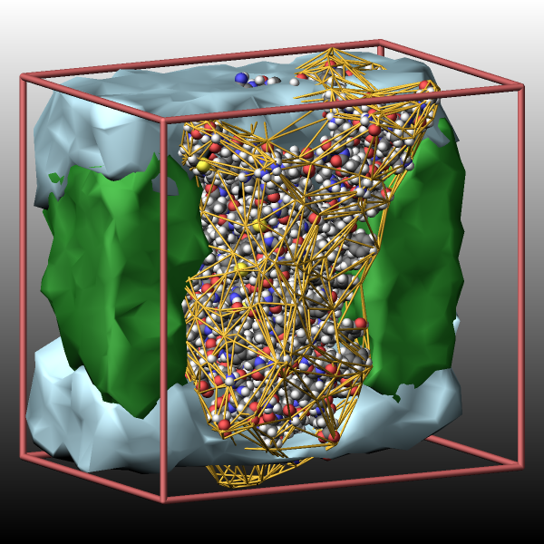

.. index:: fix graphics/chunk

fix graphics/chunk command
==========================

Syntax
""""""

.. code-block:: LAMMPS

   fix ID group-ID graphics/chunk Nevery chunkID keyword args ...

* ID, group-ID are documented in :doc:`fix <fix>` command
* graphics/chunk = style name of this fix command
* Nevery = update graphics information every this many time steps
* chunkID = ID of :doc:`compute chunk/atom <compute_chunk_atom>` command
* zero or more keyword/args pairs may be appended
* keyword = *alpha* or *clip* or *maxreplace* or *shading* or *radius* or *mindist* or *region*

  .. parsed-literal::

     *alpha* value = override multiplier for alpha shape extraction (distance units)
     *clip* value = truncate point cloud to box boundaries if *yes*, otherwise use all points
     *maxreplace* value = set the largest cluster size up to which atoms are replaced by icosahedra
     *shading* value = *smooth* or *flat*
        *smooth* = compute per-vertex normals for smooth shading (default)
        *flat* = use face normals for flat shading
     *radius* value = override per-atom or per-type radius if > 0.0 (distance units, default 0.0)
     *mindist* value = override automatic distance cutoff for slitting clusters (distance units)
     *region* value = region-ID
       region-ID = ID of region that atoms must be in to be visualized

Examples
""""""""

.. code-block:: LAMMPS

   compute cc1 all chunk/atom molecule
   fix hull all graphics/chunk 100 cc1
   fix hull all graphics/chunk 100 cc1 radius 1.0 shading smooth region upper
   fix hull all graphics/chunk 100 cc1 shading flat alpha 10.0 maxreplace 50

Description
"""""""""""

.. versionadded:: TBD

This fix generates graphics objects from chunks of atoms defined by the
:doc:`compute chunk/atom <compute_chunk_atom>` command.  For each chunk
a point cloud is created from the atom positions.  By default, for
clusters with up to 100 atoms, each atom is replaced by the the
positions of an icosahedron scaled to the radius of the atom.  For
larger clusters the point cloud only uses atom positions that shifted
away from the center of the cluster by the atom radius.  The threshold
value can be set by the *maxreplace* keyword.  A triangulated surface is
created from that point cloud using a 3-D `Delaunay triangulation
<https://en.wikipedia.org/wiki/Delaunay_triangulation>`_ combined with
`alpha shape <https://en.wikipedia.org/wiki/Alpha_shape>`_ extraction.
This allows the resulting surface to follow the shape of the chunks.
The resulting list of graphics objects is passed to :doc:`dump image
<dump_image>` for rendering via the *fix* keyword.

The positions used for the generation of the graphics are based on
coordinates for local and ghost atoms where then redundant generated
triangles are not drawn.  When a cluster straddles a periodic boundary
it should be drawn in parts on both sides of the boundary.

If available, the per-atom radius (e.g. for simulations using :doc:`atom
style sphere <atom_style>`) is used, otherwise - if available - half of
the value of the Lennard-Jones *sigma* parameter for the atom type is
used.  If neither is available, half of the lattice spacing in
x-direction is used as estimate for atom radii.

The *group-ID* selects the atoms included in the hull computation.  Only
atoms that belong to the specified group **and** are assigned to a chunk
are considered.

The *Nevery* keyword determines how often the list of the graphics
objects is recomputed.  It should match the dump frequency of the
corresponding :doc:`dump image <dump_image>` command.

The color of the graphics objects depends on the coloring scheme
selected in :doc:`dump image <dump_image>` command.  With the *type* or
*element* coloring scheme the color is based on atom type as described
below, with the *const* coloring scheme a uniform color is used instead.
This color can be set with the *fcolor* keyword of the :doc:`dump modify
<dump_image>` command.  When using atom type based colors the vertices
of the surface are colored using the atom type of the closest atom and
the color between vertices is interpolated.

If the optional *region* keyword is used, only atoms in the specified
geometric :doc:`region <region>` are used for constructing the hull.

The optional *radius* keyword allows to override the radius value used
to determine the size of the represented graphics by scaling the
octahedron positions that represents each atom for computing the
surface.

The optional *alpha* keyword allows to adjust the alpha shape extraction
algorithm which determines how closely the generated triangulation
follows the shape of chunks of atoms.  It should be at least about 3x
the average distance of closest neighbors.  For larger values, the
generated shape will become smother and more like a conventional convex
hull. A value of 0.0 (the default) triggers an estimation of a suitable
value from the average nearest neighbor distance.

The optional *clip* keyword allows to adjust the behavior for chunks
that straddle periodic boundaries.  With the default value of *yes* all
points are that are outside the simulation box are not used in the
triangulation.  When *clip* is set to *no* all points of ghost atoms
that are outside the simulation box will be included in the
triangulation.  Typically, a value of *yes* would be used with large
chunks and *no* might be preferred for small chunks.

The optional *maxreplace* keyword allows to define up to which chunk
size atoms positions are replaced by those of an icosahedron to
produce smoother surfaces.  For larger chunks, this step has few
advantages and can slow down the triangulation significantly.

The optional *mindist* keyword allows to override the heuristics used to
split larger chunks when parts of it are scattered through the
simulation box. The default value is 4x the largest radius in the
system.

The optional *shading* keyword selects how triangle normals are
determined for rendering surfaces.  The *smooth* setting (the default)
computes averaged per-vertex normals so that adjacent triangles appear
curved and blend smoothly (except for sharp edges).  The *flat* uses
the face normal for all three corners of each triangle, giving the
surface a faceted appearance.

----------

Usage example
"""""""""""""

The commands below demonstrate a more complex usage of the
*graphics/chunk* fix by using :doc:`fix property/atom
<fix_property_atom>` to assign a custom property to atoms which is used
to define the chunks.  These are commands that are added to the
``in.rhodo`` input in the ``bench`` folder.  The full input is available
in the ``examples/GRAPHICS`` folder.

.. code-block:: LAMMPS

   # get a slice of the box in x-direction
   region slice block $(xlo) $(xlo+0.6*lx) INF INF INF INF

   # assign custom integer values to atoms, so we can
   # group them into chunks by collections of atom types
   fix   0 all property/atom i_chunk ghost yes
   set type *     i_chunk 0  # default -> not part of a chunk
   set type 1*35  i_chunk 1  # protein
   set type 54*68 i_chunk 1  # chromophore
   set type 4     i_chunk 2  # solvent (water plus Na Cl)
   set type 33    i_chunk 2  # - "" -
   set type 52*53 i_chunk 2  # - "" -
   set type 36*51 i_chunk 3  # lipids

   # define groups for individual subsets
   group protein  type 1:3 5:32 34 35 54:68
   group water    type 4 33 52 53
   group lipid    type 36:51
   group other    subtract all protein

   # access the custom property and define chunks with it
   compute ichunk all property/atom i_chunk
   compute hull   all chunk/atom c_ichunk

   # use three different fixes so we can use different settings
   fix hull1 protein graphics/chunk 100 hull alpha 10.0
   # use a box slice to restrict the triangulation to part of the box
   # use clip option to cleanly truncate at the periodic box boundary
   fix hull2 water   graphics/chunk 100 hull region slice alpha 6.0 clip yes
   fix hull3 lipid   graphics/chunk 100 hull region slice alpha 6.0 clip yes

   # compute rotation angle for slow rotation around z axis
   # this needs 20000 steps for a full 360 degrees.
   variable rot equal ((step/1000*18+180)%360)-180

   # the fix vvvvvv  group selects atoms to be show, but does not affect fix graphics
   dump viz protein image 100 myimage-*.png element type size 600 600 zoom 1.5 &
         shiny 0.2 fsaa yes bond atom 0.20 view 80 v_rot box yes 0.025 &
         fix hull1 const 2 0.4 fix hull2 const 1 0 fix hull3 const 1 0
   #         ^^^ wireframe ^^^         ^^^ smooth triangle surfaces ^^^

   # set elements for atom colors and define diameters for space filling spheres
   dump_modify viz pad 9 boxcolor indianred backcolor black backcolor2 white &
     element H H H H H H H H H C C C C C C C C C C C C C N N N N N N N O O O O S S H H H H H C C C C C C N O O O P Cl Na H H H N C C C C C C C C C C C &
   adiam 1*9 1.92 adiam 10*22 2.72 adiam 23*29 2.48 adiam 30*33 2.432 adiam 34*35 2.88 &
   adiam 36*40 1.92 adiam 41*46 2.72 adiam 47 2.48 adiam 48*50 2.432 adiam 51 2.88 &
   adiam 52 3.632 adiam 53 2.176 adiam 54*56 1.92 adiam 57 2.48 adiam 58*68 2.72 &
    fcolor hull1 goldenrod fcolor hull2 lightblue fcolor hull3 forestgreen
   #  ^^^^ assign colors for triangulated graphics ^^^^^

   run             20000

----------

Dump image info
"""""""""""""""

Fix graphics/chunk is designed to be used with the *fix* keyword of
:doc:`dump image <dump_image>`.  The fix constructs a list of graphics
objects based on the size and geometry of the chunks in the fix group
and passes the information to the image renderer.

The *fflag1* setting of *dump image fix* determines whether the surface is
rendered as connected rounded triangles (1) or as a wireframe mesh of
cylinders (2).  If using a wireframe mesh, the *fflag2* setting
determines the diameter of the cylinders.

----------

Restart, fix_modify, output, run start/stop, minimize info
"""""""""""""""""""""""""""""""""""""""""""""""""""""""""""

No information about this fix is written to :doc:`binary restart files
<restart>`.

None of the :doc:`fix_modify <fix_modify>` options apply to this fix.

Restrictions
""""""""""""

This fix is part of the GRAPHICS package.  It is only enabled if LAMMPS
was built with that package.  See the :doc:`Build package
<Build_package>` page for more info.

This fix is not compatible with 2d simulations.

When running in parallel, the chunks and corresponding graphics objects
are currently computed separately for each subdomain, so that the graphics
will be different for all chunks that are distributed across sub-domains
depending on the number of processors used.

Related commands
""""""""""""""""

:doc:`compute chunk/atom <compute_chunk_atom>`,
:doc:`fix graphics/arrows <fix_graphics_arrows>`,
:doc:`fix graphics/isosurface <fix_graphics_isosurface>`,
:doc:`fix graphics/labels <fix_graphics_labels>`,
:doc:`fix graphics/lines <fix_graphics_lines>`,
:doc:`fix graphics/objects <fix_graphics_objects>`,
:doc:`fix graphics/periodic <fix_graphics_periodic>`,
:doc:`dump image <dump_image>`

Defaults
""""""""

radius = 0.0 (= auto-detect), alpha = 0.0 (= auto-detect), shading =
smooth, maxreplace = 100, clip = yes, mindist = (automatic: 4x largest
radius in system)
