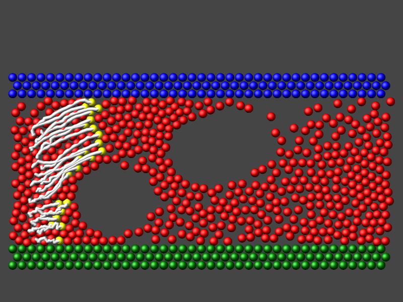
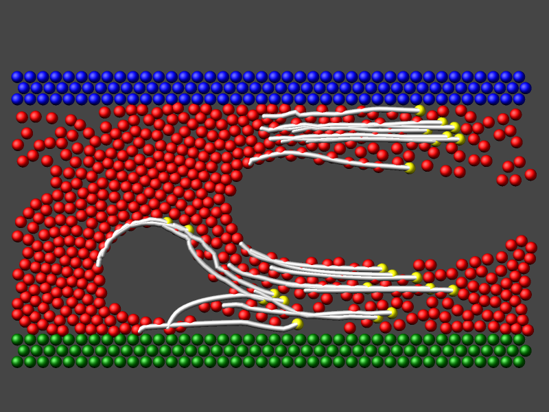
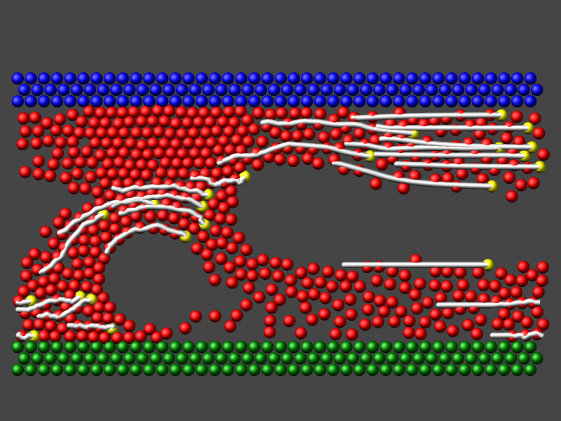

.. index:: fix graphics/lines

fix graphics/lines command
===========================

Syntax
""""""

.. code-block:: LAMMPS

   fix ID group-ID graphics/lines Nevery Nrepeat Nfreq Nlength

* ID, group-ID are documented in :doc:`fix <fix>` command
* graphics/lines = style name of this fix command
* Nevery = retrieve unwrapped position information every this many timesteps
* Nrepeat = number of times to use the position information for calculating averages
* Nfreq = store position averages every this many timesteps
* Nlength = length of averaged position history

Examples
""""""""

.. code-block:: LAMMPS

   fix  lines  ogroup  graphics/lines 10 50 500 15

Description
"""""""""""

.. versionadded:: 11Feb2026

This fix allows to add a trace of averaged atom positions in the fix
group to images rendered with :doc:`dump image <dump_image>` using the
*fix* keyword.  This kind of position trace is sometimes referred to as
"trajectory lines".

The trace is represented by a chain of connected cylinders where the
endpoints are taken from the current atom positions and an internal
history of averaged positions of the atoms.  The averaging is performed
by using :doc:`fix ave/atom <fix_ave_atom>` internally on unwrapped atom
positions taken from :doc:`compute property/atom
<compute_property_atom>`.  The *Nevery*, *Nrepeat*, and *Nfreq* values
are passed on to the internal fix *ave/atom* instance for averaging.
The averaged unwrapped positions are wrapped back into the simulation
box and stored internally using up to *Nlength* sets.  For any
additional sets of positions, the then oldest set in the history storage
will be overwritten and thus limiting the length of the trace.

The *group-ID* sets the group ID of the atoms selected to have the selected
property represented.  This may *not* be a dynamic group.

The *Nfreq* value determines how often the graphics data is updated.
This should be the same value as the corresponding *N* parameter of the
:doc:`dump <dump>` image command.  LAMMPS will stop with an error
message if the settings for this fix and the dump command are not
compatible.

-----------

Dump image info
"""""""""""""""

Fix graphics/lines is designed to be used with the *fix* keyword of
:doc:`dump image <dump_image>`.  The fix will add a connected chain of
cylinders based on the averaged position history of the atoms in the fix
group to the rendered image.

The color of the cylinders is by default that of the atoms when using color
styles "type" or "element".  With color style "const" the default value
of "white" can be changed using :doc:`dump_modify fcolor <dump_image>`.
The transparency is by default fully opaque and can be changed with
*dump\_modify ftrans*\ .

The *fflag1* setting of *dump image fix* determines whether the cylinder
objects are capped with spheres: 0 means no caps, 1 means the lower end
is capped, 2 means the upper end is capped, and 3 means both ends are
capped.

The *fflag2* setting determines the diameter of the cylinders.

The following input can be added to the ``examples/obstacle/in.obstacle``
example input after adjusting its :doc:`create_box <create_box>` and
:doc:`mass <mass>` commands to support 4 atom types instead of 3.

.. code-block:: LAMMPS

   # select atoms to trace and assign atom type 4 so they have a different color (yellow)
   region   trace block 2 3 1.25 8.75 INF INF
   group    trace region trace
   set      group trace type 4

   # create trajectory lines by averaging positions over 10 MD steps each 10 steps apart
   fix      lines trace graphics/lines 10 10 100 25
   # visualize the trace in silver with a diameter of 0.6 which is half of that of the atoms
   dump     viz   all image 100 obstacle-*.png type type size 800 600 zoom 2.5 center s 0.50 0.7 0 &
                                           shiny 0.5 fsaa yes box no 0.025 fix lines const 1 0.6
   dump_modify  viz  pad 6 backcolor darkgray adiam * 1.2 fcolor lines silver

|lines1|  |lines2|  |lines3|

.. raw:: html

   
(Trajectory lines visualization example. Click to see the full-size images)
 

Restart, fix_modify, output, run start/stop, minimize info
""""""""""""""""""""""""""""""""""""""""""""""""""""""""""

This fix writes its current status to :doc:`binary restart files
<restart>`.  See the :doc:`read_restart <read_restart>` command for info
on how to re-specify a fix in an input script that reads a restart file,
so that the fix continues in an uninterrupted fashion.  Upon restarting,
the fix checks that the *Nevery*, *Nrepeat*, *Nfreq*, and *Nlength*
settings are the same as when the restart file was written.  Otherwise
it stops with an error.

None of the :doc:`fix_modify <fix_modify>` options apply to this fix.

This fix computes a global scalar representing the current length of the
position history vector.

Restrictions
""""""""""""

This fix is part of the GRAPHICS package.  It is only enabled if LAMMPS
was built with that package.  See the :doc:`Build package
<Build_package>` page for more info.

Related commands
""""""""""""""""

:doc:`fix graphics/arrows <fix_graphics_arrows>`,
:doc:`fix graphics/isosurface <fix_graphics_isosurface>`,
:doc:`fix graphics/labels <fix_graphics_labels>`,
:doc:`fix graphics/objects <fix_graphics_objects>`,
:doc:`fix graphics/periodic <fix_graphics_periodic>`,
:doc:`fix ave/atom <fix_ave_atom>`

Defaults
""""""""

none
