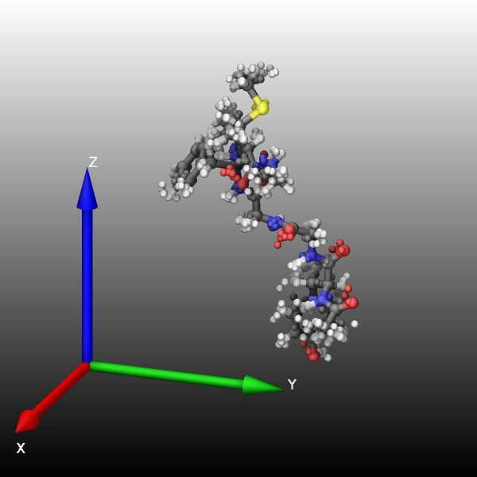
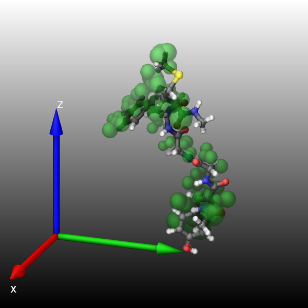

.. index:: fix graphics/replica

fix graphics/replica command
============================

Syntax
""""""

.. code-block:: LAMMPS

   fix ID group-ID graphics/replica Nevery type keyword args ...

* ID, group-ID are documented in :doc:`fix <fix>` command
* graphics/replica = style name of this fix command
* Nevery = update graphics information every this many time steps
* keyword = *display* or *average*

  .. parsed-literal::

     *display* radius = radius for the atoms or -1 to use the radius dump image uses for the atom type
     *average* radius = radius for the atoms or 0 to set the radius to that of the largest distance from the center

Examples
""""""""

.. code-block:: LAMMPS

   fix sf1 water graphics/replica 200 display 1.0 average 0

Description
"""""""""""

.. versionadded:: TBD

This fix allows to add spheres to images rendered with :doc:`dump image
<dump_image>` using the *fix* keyword to represent atoms from all
replicas of a multi-replica simulation.

The *group-ID* sets the group ID of the atoms selected to be
represented.  This may be a dynamic group.

The *Nevery* keyword determines how often the replica graphics data is
updated.  This should be the same value as the corresponding *N*
parameter of the :doc:`dump <dump>` image command.  LAMMPS will stop
with an error message if the settings for this fix and the dump command
are not compatible.

There are two keywords available that determine what is shown: *display*
and *average*.  With *display* all atoms in the fix group from all
replica will be displayed.  With *average* only the average position of
the atoms with the same atom-ID across all replica will be shown.

The *radius* quantity determines the radius of the atoms.  A value > 0
sets an explicit radius; a value < 0 will use the same radius used by
dump image for local atoms of the same atom type.  For the keyword
*average*, a *radius* sets the atom radius to the largest distance of
an atom to the average position across all replica.

-----------

Dump image info
"""""""""""""""

.. versionadded:: TBD

Fix graphics/replica is designed to be used with the *fix* keyword of
:doc:`dump image <dump_image>`.  The fix will add spheres based on the
atoms in the fix group across all replica to *dump image* so that they
are included in the rendered image.

The *fflag1* setting of *dump image fix* are currently ignored.

and *fflag2* setting of *dump image fix* is used as an adjustment
to the radius of the rendered sphere.  This can be used to grow or
shrink the radius that is selected by *dump image* for the atom type.

----------

Usage example
"""""""""""""

The following lines can be added to the peptide example to run it
in multi-partition mode so it will have diverging trajectories.

.. code-block:: LAMMPS

   # reinitialize velocities differently on each partition
   variable part uloop 16
   velocity all create 275.0 $(12315235*v_part)

   fix  sf1  peptide   graphics/replica 100 display 0.5
   fix  sf2  peptide   graphics/replica 100 average 1.0

   # must use dump image only on one partition
   partition yes 1 dump viz peptide image 100 myimage-*.png element type size 600 600 zoom 1.77156 shiny 0.2  &
                    ssao yes 23184 0.4  fsaa yes bond atom type view 70 20 box no 0.0 axes yes 0.5 0.05 &
                    fix sf2 const 0 0 &
                    fix sf1 element 0 0 &

   partition yes 1 dump_modify viz pad 6 backcolor black backcolor2 white &
                element C C O H N C C C O H H S O H &
                adiam 1*2 0.85 adiam 3 0.76 adiam 4 0.6 adiam 5 0.775 adiam 6*7 0.85 adiam 8 0.85 &
                adiam 9 0.76 adiam 10*11 0.6 adiam 12 0.9 adiam 13 0.76 adiam 14 0.6 &
                ftrans sf2 0.5 fcolor sf2 green

|replica1|  |replica2|

----------

Restart, fix_modify, output, run start/stop, minimize info
"""""""""""""""""""""""""""""""""""""""""""""""""""""""""""

No information about this fix is written to :doc:`binary restart files
<restart>`.

None of the :doc:`fix_modify <fix_modify>` options apply to this fix.

Restrictions
""""""""""""

This fix is part of the GRAPHICS package.  It is only only enabled if
LAMMPS was built with that package.  See the :doc:`Build package
<Build_package>` page for more info.

Related commands
""""""""""""""""

:doc:`fix graphics/arrows <fix_graphics_arrows>`,
:doc:`fix graphics/labels <fix_graphics_labels>`,
:doc:`fix graphics/isosurface <fix_graphics_isosurface>`,
:doc:`fix graphics/objects <fix_graphics_objects>`,
:doc:`fix graphics/periodic <fix_graphics_periodic>`

Default
"""""""

none
